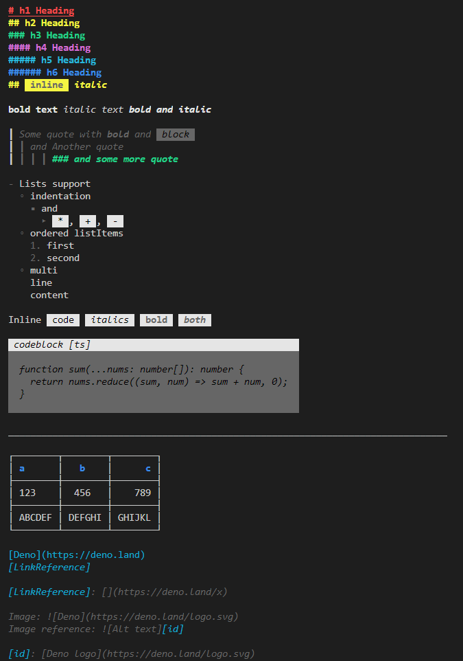

# 🎩 charMD

[](https://deno.land/x/charmd)
[](https://github.com/littletof/snapper)

*A simple, extendable markdown renderer for your terminal.*

> 🚧 This module is in early developement, expect breaking changes 🚧

**`charMD`** enables you to render a markdown text into a string, which printed in the terminal provides a well formatted output, instead of plain text.



## Try it out

To see the general capabilities of this module run:

```bash
deno run https://deno.land/x/charmd/example.ts
```

To see, how a specific markdown gets rendered run:

```bash
deno run --allow-read https://deno.land/x/charmd/example.ts ./README.md
```

## Usage

Simply import the module and call the `renderMarkdown` method with your markdown text.

```ts
import { renderMarkdown } from 'https://deno.land/x/charmd/mod.ts';

console.log(renderMarkdown('# Hello world 🌍!'));
```

### 🧩 Extensions

The module provides a way to extend it functionality with additional extensions, which can be provided in it's `options` param.

An extension can implement any of the `Extension` interface's methods, which are:

- `init`: Called before AST generation, if a string is returned, it will override the input markdown for later extension's init fn and processing steps.
- `postAST`: Called with the generated AST's root node, before any    transformations
- `transformNode`: Called with each node to do modifications on the node and it's children in the `AST`.
- `postTransform`: Called with root, after all the transformations ran for all nodes.
- `generateNode`: Called with each node. It should return the string representation of the rendered node,if the extension handles that specific node, or void, if its not handled by the extension.
- `postGenerate`: Called after the string representation is created.

A simple extension, that renders `link` with green and blue instead of the built-in cyan would look something like this:

```ts
const LinkExt = {
    generateNode(genFn, node: Node, parent: Node, options: Options) {
          if(node.type === 'link') {
            const linkText = node.children?.map(ch => genFn(ch, node, options)).join('') || '';
            const link = `Link with text '${colors.blue(linkText)}' points to ${colors.cyan(node.url!)}`
            return colors.green(link);
          }
      }
}

console.log(renderMarkdown(
    '[charMD](https://github.com/littletof/charmd)',
    { extensions: [LinkExt] }
));
```

### Direct use - `cli.ts`

For direct use in the terminal run `cli.ts`:

```bash
deno run --allow-net https://deno.land/x/charmd/cli.ts -r https://raw.githubusercontent.com/denoland/deno/master/README.md
```

Or install it with `deno install`

It has three options:

- `-s` for rendering a string directly: `-s "# markdown string"`
- `-l` for rendering a local file: `-l ./README.md`
- `-r` for rendering a remote file: `-r https://raw.githubusercontent.com/denoland/deno/master/README.md`

## Permissions

The module itself requires no permissions to run.

> If `--unstable` is provided, horizontal separators will consider the terminal's width.

<!--
|Flag| Required |Reason|
|:--|:-:|:--|
| 🚧 `--unstable`  |  | If provided, the horizontal separator will consider the terminals width |
-->

## Limitations

- No syntax highlight
- No multiline tables cells
- Possible hiccups with more complex markdowns (Please open an issue about it)

These could change in the future, but the aim is to keep the module's complexity minimal.
> Also, many of these should also be solvable using extensions.
>
> [syntax highlight example](https://github.com/littletof/charmd/issues/2#issuecomment-832771746)

## Notes

- The main functions are also exported from the module, so for example you can use the `toAST` function to get your ast for the markdown and process it yourself.

- As its core, it currently uses [mdast-util-from-markdown](https://github.com/syntax-tree/mdast-util-from-markdown), to get the `AST`, you can also provide extensions to it in the options **unstable** `mdast` property.

- This module's core structure draws from @dephraims work with <https://github.com/dephraiim/termd>.

## Contributions

Feedback and contributions are always welcome. Open an issue or a PR, or contact me on the Deno discord.

## TODO

- [x] fix lists
- [x] remove dots from codeblock backgrounds
- [x] links with images
- [x] ```# Header with *italic*```
- [x] strikethrough, ~~underline~~
- [x] basic tests
- [x] lint
- [ ] fmt
- [ ] Look into alternatives for the AST generation.
