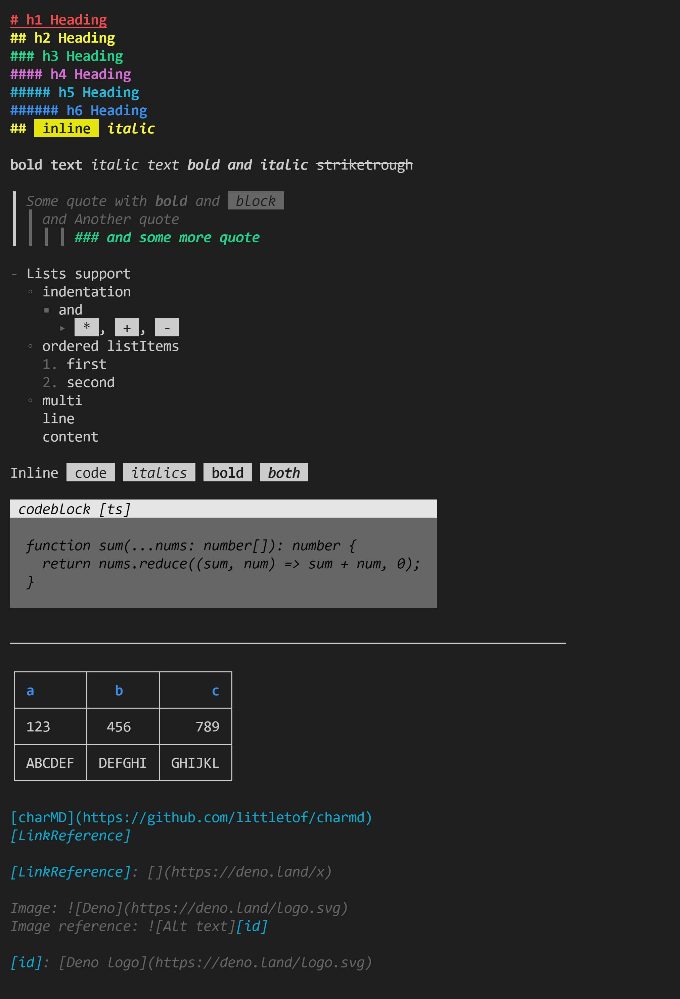

# Deno terminal markdown

Enables you, to render a markdown text into a string, which printed in the terminal provides a formatted output, instead of plain text.



As its core, it currently uses <https://github.com/syntax-tree/mdast-util-from-markdown>, to get the `AST`.

This module draws heavily from @dephraims work with <https://github.com/dephraiim/termd>.

## Try it out

To see a general capabilities of this module run:

```bash
deno run ./example.ts
```

To see, how a specific markdown gets rendered run:

```bash
deno run --allow-read ./example.ts ./README.md
```

## Usage

```ts
import { renderMarkdown } from './mod.ts';

const md = Deno.readTextFileSync(Deno.args[0]);
console.log(renderMarkdown(md));
```

The main functions are also exported from the module, so you can use the `toAST` function to get your ast for the markdown and process it yourself.

Also, since its a wrapper for [mdast-util-from-markdown](https://github.com/syntax-tree/mdast-util-from-markdown), you can pass `extensions` to it in the options, which should work too.

## Permissions

The module itself requires no permissions to run.

## Limitations

- No syntax highlight
- No table formatting
- No \~\~strikethrough\~\~ or underline
- Some hiccups with more complex markdowns

These could change in the future, but the aim is to keep minimal complexity.

## Contributions

Feedback and contributions are always welcome. Open an issue or a PR, or contact me on the Deno discord.

## TODO

- fix lists
- strikethrough and underline and combinations
- links with images
- ```# Header with *italic*```
